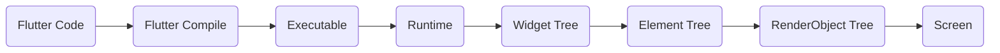
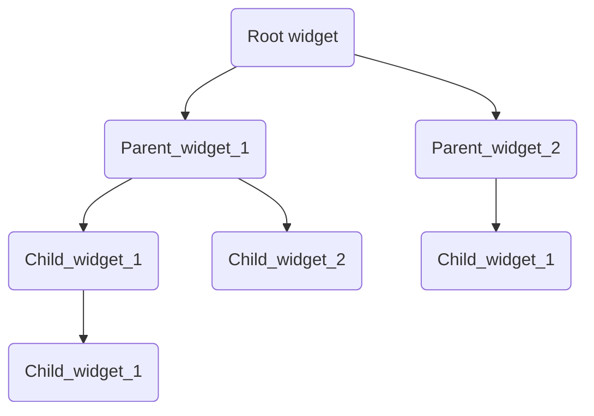
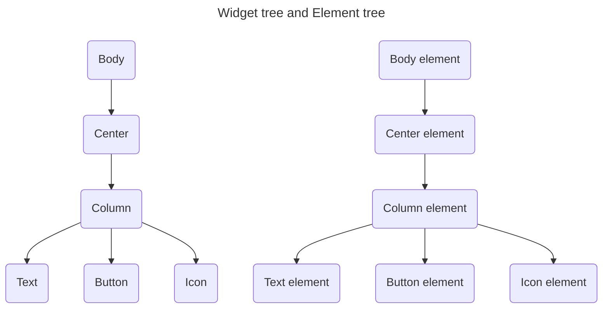
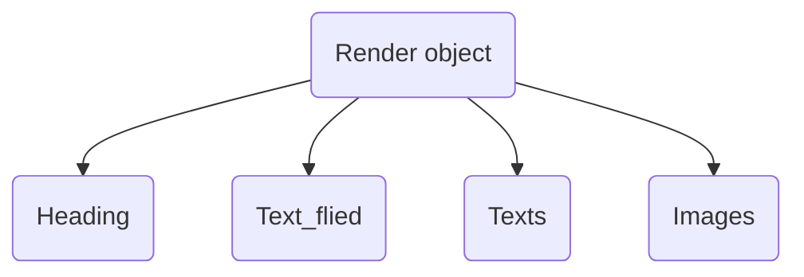

# How Flutter Turns Code into UI

Flutter doesn't draw your UI directly from the Dart code you write. It goes through a series of transformations — each one turning a more abstract representation into a more concrete one — until it finally becomes pixels on the screen. Below is the step-by-step journey.



---

## Step 1: The Code

This is the Dart source code you actually write — your `StatelessWidget`s, `StatefulWidget`s, and everything wired together with `build()` methods. At this stage, it's just text in `.dart` files sitting in your project.

## Step 2: `flutter run command` Compiles the Code

When you run the flutter run command, Flutter takes your source `code` and compiles it. This is the point where your human-readable Dart gets processed by the compiler into a form the machine can work with.

## Step 3: Compiled Code Becomes Executable Code

The compiled code which is going to turned into `executable code` — the actual binary/package that can be launched on a device or emulator. 

## Step 4: The Runtime Takes Over

Once the executable is launched, the **Flutter runtime** kicks in. During the runtime, the compiled code is loaded into `[built()]`, kicking off the process that builds the **Widget Tree**. This is the transition point from "static compiled program" to "a live, running app that is actively constructing its UI."

## Step 5: The Widget Tree is Built

This is the first UI-related structure Flutter builds. It's a basic tree of `Element` nodes describing **what** the UI should look like — a blueprint, not the actual rendering.



A widget tree is fundamentally **immutable and lightweight** — it's just configuration. Every time `build()` runs, a `brand new widget tree is created`. This is why widgets themselves are cheap to create and throw away.

## Step 6: The Widget Tree Becomes the Element Tree

This is a **runtime structure** of the widget tree, known as the **Element Tree**. It contains the build/content for each element and maintains:
- The **child-parent relationship** between elements and their properties
- The **lifecycle information** of each element (created, mounted, updated, disposed)


> The conversion flow of element tree with an example code
```dart
class MyWidget extends StatelessWidget {
  Widget build(BuildContext context) {
    return Container(
      child: Text("Hello"),
    );
  }
}
```
- At first `MyWidget runs its build method`, creates an `Element in element tree`, returns the `description of Container`, then Container runs then it return the context and the **container's element is added to the Element tree by updating the Element tree**.

```text
MyWidget widget [run its built()]
        ↓
        ↓
MyWidget's Element is created/mounted [Element tree is created]
        ↓
        ↓
Flutter calls build(context) [build() returns Container widget description]
        ↓
        ↓
Flutter reconciles/compare that Container widget with the child slot of MyWidget's Element
[Check the description is already exist or not]
        ↓
        ↓
Container's Element is created/mounted
[For the first build it going the child slot of Mywidget's element will be empty so it will recreate the tree]
        ↓
        ↓
Container's Element builds its subtree [Then the build() runs and return its child description]
        ↓
        ↓
Text widget description [Now its a RenderObject widget, So after this the will be no more widget to build/return]
        ↓
        ↓
Text's Element is created/mounted [Create a text element]
```

## Step 7: The Element Tree Produces the RenderObject Tree

Each element that needs to be drawn on screen is linked to a **RenderObject**. Together, these form the **RenderObject Tree**.



This tree performs and handles the **actual UI work**:
- **Layout** — figuring out size and position
- **Painting** — calculating pixels and how things visually appear

It also **provides constraints and size information** to both the parent and child render objects, so each element knows how much space it has and how much space it needs — this negotiation between parent and child constraints is core to how Flutter's layout algorithm works.

## Step 8: Pixels on Screen

Once the RenderObject Tree has computed layout and painting, Flutter composites everything and hands it off to the GPU to actually display it on screen — completing the journey from `code` to pixels.

---

## Quick Recap

| Stage | What it represents | What it does|
|---|---|---|
| Widget Tree | Blueprint / configuration ("what") | Immutable, flutter will rebuild this one each time it run the `.build()`|
| Element Tree | Runtime structure, manages lifecycle | Reused across rebuilds flutter compare the existing one with the new widget description then decide to reuse/recreate in the element tree|
| RenderObject Tree | Layout + painting ("how") |Mutated in place. In this stage were the actual laout and positioning will happend |

**Core idea:** The `Widget Tree` describes *what* the UI should look like, the `Element Tree` manages *how it's connected and remembered* over time, and the `RenderObject Tree` actually *does the work* of measuring, positioning, and painting pixels.
