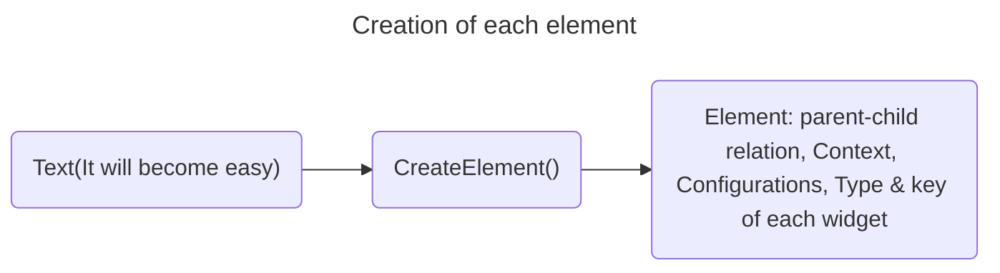
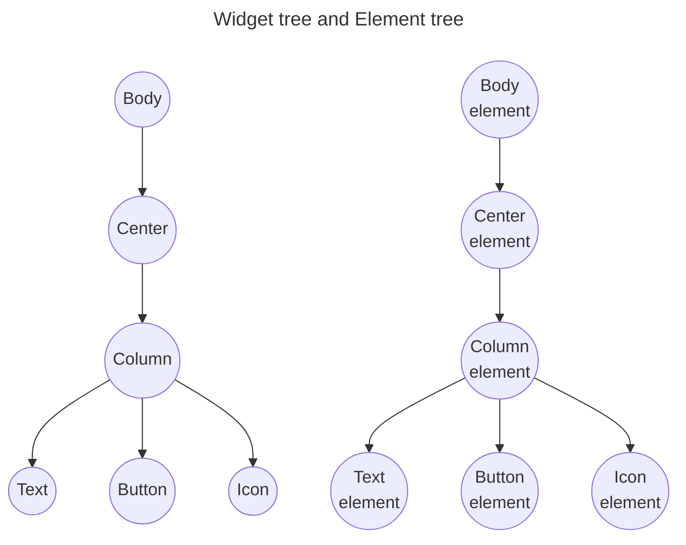
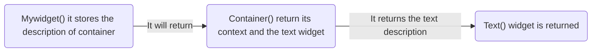
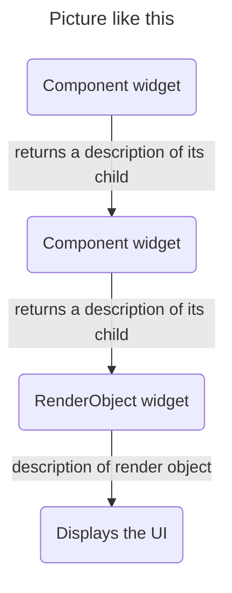
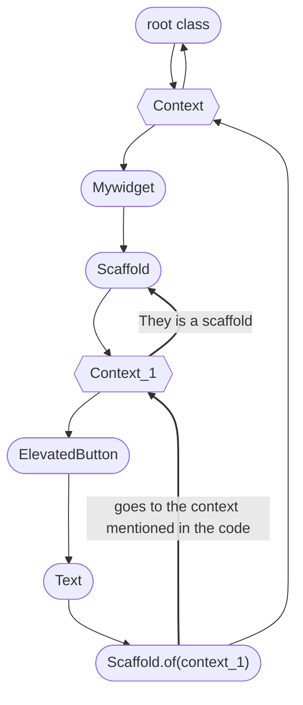

# Learning how flutter work behind the code

So, I recently built my first Flutter application. If you want to check out my work, [Focus-hub](https://github.com/Dharanesh192/Focus-hub).

After building that project, I became curious about how **Flutter actually works**,how it converts my **code into UI** based on the platform I’m targeting, how it **navigates between different screens**, and what **terminologies** are used in Flutter.

So, I’m going to explain these things in **3 documents**:

* In this one, I’m going to cover **Flutter terminologies**.
* Then, to learn how **Flutter code is converted into UI**, check this file: [Flutter code to UI.md](Flutter_code_to_UI.md)
* For learning about **navigation**, check this file: [Navigation.md](Navigation.md)


## Concepts that you are going to learn from this documentation
- **Widget Tree**
  - What is a `Widget` ?
  - What does a widget description contain?

- **Element Tree**
  - What is an `Element` ?
  - How the `element` are created ?
  - Where did the Element Tree exists.
  - How Elements remains between each rebuilds.

- **RenderObject**
  - What a `RenderObject` ?
  - Which Elements have RenderObjects and which don't.

- **Build**
  - What `build()` actually does ?
  - How Flutter decide to update/rebuild the existing Elements based on the new widget description.
  - What is `State` in the Statefullwidget() ?
  - What `setState()` actually do in your UI.
  - How `rebuilt` works and what gets a rebuild and what doesn't ?

- **BuildContext**
  - What is a `Context` in your UI ?
  - what are the `Component widget` and `RenderObject widget`
  - What is the meaning of Scaffold.of(context)
  - How flutter `look up for the ancestor element` in the tree ?

- **Layouts and Responsive UI**
  - Layout includes `Row, Column, Expanded, etc.`
  - What are `Constraints` and `Size` ?
  - How available constraints change with screen size.
  - How you can build different layout based on your screen size ?

- **Navigation and Routes**
  - What is mean by `Navigator` ?
  - How `navigator's route` stack works \[ Navigator.push(), Navigator.pop() \]
  - What a Route is.

- **showDialog()**
  - What showDialog() actually does.
  - Why it uses Navigator.
  

## Widget description

A widget description is the configuration of one widget: what type it is
and how it should be configured.

``` dart
Text(
  "Dharanesh",
  style: TextStyle(
    fontSize: 24,
    fontWeight: FontWeight.bold,
  ),
)
```

Conceptually:

``` text
Text
├── text: "Dharanesh"
├── fontSize: 24
└── fontWeight: bold
```

It describes **what UI should exist and how it is configured**.

It does not contain the final screen coordinates or pixels.

## Widget Tree

The Widget Tree is the hierarchy of widget descriptions.

``` text
Scaffold
├── AppBar
└── Card
    └── Column
        ├── Text("Customer Name")
        ├── Text("Phone Number")
        └── ElevatedButton("Login")
```

Think:

> **Widget Tree = blueprint / desired UI structure.**

## Element and Element Tree

- An **Element** class are the implementation of `Buildcontext` we will see that later.
- The element is **created by a method called createElement()**, this method will convert the **widget description into an element**.
- In the runtime process every widget in `Statelesswidget()` or `Statefullwidget()` are pass through this method to create they respective elements.


Conceptually:



- Elements maintains a `runtime structure`, `parent-child relationships`, `Context the location details of the widget in the tree`
current widget configuration associated with that location,
`lifecycle information`, and the location represented by the Element.

- The Element Tree is maintained in `RAM` while the app is running.


 
- Do not think of an Element as the object that stores final screen
coordinates. Geometry belongs to the rendering/layout system.

## RenderObject

RenderObjects handle the physical layout and painting side of Flutter.

They deal with things such as:

-   constraints
-   size
-   position
-   layout
-   painting
-   Touch functionality

- Not every widget has it own RenderObject. The widgets like \[ `Row`, `column`, `Stack`, `Expand`, `Listview`, `Builder` \] this all are used for `arrangement or positioning other widgets` in UI and this are `Component widgets that can compose other widgets`. So this can't have any separate `RenderObject` to show in the screen but can be used for other things such as **layout arrangements**
- The other elements like \[`Text`,`Icon`,`Image`,\] this are `RenderObjectWidgets correspond to RenderObjectElements that manage RenderObjects.`. It means simply this kind of element can have its `own RenderObject`

Simplified:

``` text
Constraints are given
     |
     v
Calculate size from child
     |
     v
Determine layout/position
     |
     v
Paint the UI
     |
     v
Pixels appear in the screen 
```

Think it as:

> **RenderObject = "How should this UI occupy space and be painted?"**


## Build

`build()` is a method that creates and returns new widget descriptions. This **build()** can be used `anywhere in the UI` to create `the widget description`.
build() receives a BuildContext that represents the current location in the Element tree
``` dart
@override
Widget build(BuildContext context) {
  return Card(
    child: Text("Hello"),
  );
}
```

Think:

> **build = "What widgets should exist here right now?"**

- Flutter reconciles the returned widget descriptions from the build() with the existing
one.

- So that the element tree is not recreated whenever your application run a build command. Instead flutter compair
  the new `widget description` created by the `build()`with the old `existing element tree by its type/key` of that widget in the element tree.
  Based on the change it descide to `rebuild/update` the existing element tree.

## State
- So consider state is associated with the StatefulElements.
- It stores mutable runtime values such as count value.
- The State object persists through ordinary rebuilds.
- Therefore, its values don't return to their initial values in every time build() runs.

An example workflow without the state
```text
You initialize count = 0
     |
     v
For the first build()
     |
     v
It displays count = 0
     |
     v
setstate() => It run count++ then state will change and mark this element as dirty
     |
     v
After rebuild
     |
     v
It still displays count = 0
```

because **count is a local variable inside build()**. Every time build() executes, that local **variable is created again and initialized to 0**. But **with state the count is now belongs to state object** as it provide persistent storage for mutable state so its **value will not reset during the rebuild**


## setState() and rebuild
Setstate are used to **update the UI during the runtime** by triggering some event from user like pressing some button in the UI

``` dart
setState(() {
  count++;
});
```

Simplified flow:

``` text
User taps button
      ↓
setState()
      ↓
  count++    ← actual state is change
      ↓
Element marked dirty
      ↓
Flutter schedules rebuild
      ↓
build() runs  ← The count value is stored in state object
      ↓         so it doesn't reinitialized again and again
      ↓
Text("$count")
      ↓
Text("1")   ← new Widget description
      ↓
Flutter compares/reconciles by it widget type/key
      ↓
Now flutter decide reuse / update / create / remove the elements tree
      ↓
existing Text Element updated
      ↓
RenderObject updated if necessary
      ↓
UI shows "1"
```

A normal state change does not mean the whole Element Tree is destroyed
and recreated.

## BuildContext

- `BuildContext` is the context that let as know where our widget is located in the widget Tree.

**Let's see an example**

``` dart
class Mywidget extends StatelessWidget{
  Widget build(BuildContext context) {
    return Container(
      child: Text("Hello to myself"), 
    );
  }
}
```
- Technically, that the `BuildContext is the interface implemented by the Element`, not a separate object sitting beside it. Flutter's documentation explicitly says that `BuildContext objects are actually Element objects`
- So now let's see how this code is turned into UI
  - So first all the `widget description are returned by the main class's build()` method in one-by-one order. 
  - When the application run the `main class` (**Mywidget**) will return its context then it calls the framework to create/mount that element and returns its `child widget description` (**container**)
  - Then the `container's build()` will run and return its `child widget description` (**Text**) and `repeat this process` for all the widgets.
    


> **They are two kind of widgets for this method**

- Component widget
- RenderObect widget

### Component widget
- A component widget has a corresponding `build() to return the description of the child widget`. Component Elements keep `building/reconciling widget descriptions` of the child widget `until the framework reaches RenderObjectWidgets`. Example widgets are **Container, Listview and more** 

### RenderObject widget
- A Renderobject widget `doesn't have a build method to return any widget description of its child`. The `RenderObjectWidget` as providing configuration for `RenderObjectElement`, which wraps the actual `RenderObject`. Which performs layout and painting. Example widgets are **Flex, Stack, Wrap, SizedBox, Opacity and more**



## Meaning of Scaffold.of(context)
`Scaffold.of(under_context)` is that first go to context that mention in the code `under_context` and from that look upward to find the buildcontext of that element `Scaffold`.
- It simply means go to that context (under_context) and find the element (Scaffold)

## Let's see how the different context works
- It is important to know that, the `name of the context can be anything`.
- So as I mention above `An Element class are the implementation of Buildcontext` Now it the time to look that
- So `each element` is going to have its own `Buildcontext` and when we use something like this `Mywidget build(Buildcontext context)` it going to creating a context to look up in the element tree.
- That context is used to `find the needed element in the element tree` from that context. 

> Let's learn this with an example

```dart
class Mywidget extends StatelessWidget{
  Widget build(BuildContext context) {
    return Scaffold(
       build(BuildContext Context_1){
        body: ElevatedButton(
          onpressed: () => Scaffold.of(context).showBottomSheet(
            Text("It's the bottom sheet")
        )
        child: Text('Show the bottom sheet')
        )
      )
    }
  }
}
```
> So this code is going to create a button in the screen to show the bottom sheet. But this code run perfectly and also will return an error based on which context we are using. Let see how ?



- So when the user press the elevated button the **flutter goes to that context that mentioned in the code and look upward to find that element in the tree**
- In this example they are two different context namely `context` and `context_1`
- If we use the `Sacffold.of(context)`.In this case **the context is about the Scaffold**. So now it's go to the context and look up and they is **only root no Scaffold**
- That's why it going to return an error about **they is no scaffold in the given context**
- This problem can be `solved by using the context below the scaffold`.
-  If we use the `Sacffold.of(context_1)` in the code **flutter goes to the context_1** and looks upward for the scaffold and **it will find it**

## Layouts

Layout are the arrangement of the widget in our UI. Flutter's layout itself have widgets such as `Row, Column, Center, Expanded, etc`. Compose together to create the layout in a combined layout.
- **Row** -> Row arranges children `horizontally`.
- **Column** -> Column arranges children `vertically`.
- **Expanded** -> It allow the child to occupy the space allocated to the flex slot
  
## Constraints and Size

Constraints are rules/limits supplied during layout:

``` text
minWidth
maxWidth
minHeight
maxHeight
```

The child chooses a size that satisfies those constraints.

``` text
Parent
  |
  | constraints
  v
Child
  |
  | chooses
  v
Size
```

A useful simplified rule is:

> **Constraints go down. Sizes come back up.**

## mounted

`mounted` is lifecycle information of the state in the element tree.

``` dart
if (!mounted) return;
```

Think:

> **mounted = "Is this State still attached to an Element?"**

This is especially important after asynchronous work:

``` dart
Future<void> loadData() async {
  await someOperation();

  if (!mounted) return;

  setState(() {
    // update UI
  });
}
```

The async operation can finish after the user has navigated away. The
State may then no longer be mounted.

`mounted` does not mean "currently visible on the screen." It means the
State is still attached to an Element.

## Final memory table

  |Concept             | Simple meaning|
  -------------------- |-----------------------------------------------------------|
  |Widget description  |Configuration describing one piece of UI|
  |Widget Tree         |Hierarchy of widget descriptions|
  |Element             |Persistent runtime node/location associated with a widget|
  |Element Tree        |Persistent runtime structure Flutter manages|
  |build               |Method that creates/returns widget descriptions|
  |BuildContext        |Handle representing an Element's location|
  |mounted             |Whether the State is still attached to an Element|
  |RenderObject        |Handles layout and painting|
  |Constraints         |Limits supplied during layout|
  |Size                |Size chosen within those limits|

https://docs.flutter.dev/resources/architectural-overview
