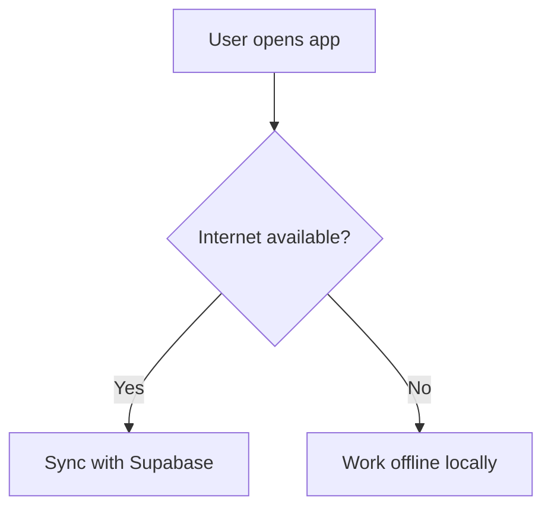

# Markdown (.md) — Complete Syntax Reference with Rendered Output

> Each entry shows: **Use case** (when/why you'd reach for it), **Input** (the raw code you type), and **Output** (what it actually looks like once rendered). Core Markdown works everywhere; items marked **(GFM)** need GitHub Flavored Markdown, and **(Ext)** need a specific tool (Obsidian, static site generators, etc.)

---

## 1. Text Structure

### Heading

**Use case:** Organizing a document into sections/sub-sections — like chapters and sub-chapters. Search engines and table-of-contents generators also use these to build navigation.

**Input:**
```
# Heading 1
## Heading 2
### Heading 3
```

**Output:**

# Heading 1
## Heading 2
### Heading 3

---

### Paragraph & Line Break

**Use case:** Normal body text. A blank line = new paragraph. Two trailing spaces = line break *within* the same paragraph (useful for addresses, poems, short lists that shouldn't be full paragraphs).

**Input:**
```
Line one␣␣
Line two

New paragraph
```

**Output:**

Line one
Line two

New paragraph

---

### Horizontal Rule

**Use case:** Visually separating unrelated sections (e.g., end of an article before a footer, or between chapters).

**Input:**
```
Above the line

---

Below the line
```

**Output:**

Above the line

---

Below the line

---

### Blockquote

**Use case:** Quoting someone, highlighting a callout/warning, or setting apart external text (like an email reply or a citation).

**Input:**
```
> Markdown is easy to learn.
> — Someone, probably
```

**Output:**

> Markdown is easy to learn.
> — Someone, probably

---

### Escaping

**Use case:** When you need a literal `*`, `#`, or `_` character to show up instead of triggering formatting (e.g., writing about Markdown itself, or math like `2*3`).

**Input:**
```
\*This is not italic\*
```

**Output:**

\*This is not italic\*

---

## 2. Emphasis

### Bold / Italic / Both

**Use case:** Bold = draw the reader's eye to a key term or warning. Italic = subtle emphasis, titles of works, foreign words. Both = maximum urgency (use sparingly).

**Input:**
```
**Deploy on Friday is risky.**
*Use with caution.*
***Do not skip this step.***
```

**Output:**

**Deploy on Friday is risky.**
*Use with caution.*
***Do not skip this step.***

---

### Strikethrough (GFM)

**Use case:** Show something is outdated, cancelled, or corrected — common in changelogs, to-do lists, and editing drafts.

**Input:**
```
~~Meeting at 3 PM~~ Meeting moved to 4 PM
```

**Output:**

~~Meeting at 3 PM~~ Meeting moved to 4 PM

---

## 3. Lists

### Unordered List

**Use case:** Items with no particular order — features, ingredients, bullet notes.

**Input:**
```
- Python
- Pandas
- Scikit-learn
```

**Output:**

- Python
- Pandas
- Scikit-learn

---

### Ordered List

**Use case:** Steps that must happen in sequence — a tutorial, setup instructions, a ranked list.

**Input:**
```
1. Clone the repo
2. Install dependencies
3. Run the app
```

**Output:**

1. Clone the repo
2. Install dependencies
3. Run the app

---

### Nested List

**Use case:** Showing hierarchy — sub-tasks under a main task, sub-topics under a topic.

**Input:**
```
- Machine Learning
  - Supervised
  - Unsupervised
```

**Output:**

- Machine Learning
  - Supervised
  - Unsupervised

---

### Task List (GFM)

**Use case:** Trackable to-do lists in READMEs, GitHub issues, project planning docs — checkboxes are clickable on GitHub.

**Input:**
```
- [x] Build the model
- [ ] Deploy the model
- [ ] Write documentation
```

**Output:**

- [x] Build the model
- [ ] Deploy the model
- [ ] Write documentation

---

## 4. Links & Media

### Link

**Use case:** Pointing to external resources, documentation, references, or other pages.

**Input:**
```
[Velalar College](https://www.velalarcollege.edu.in)
```

**Output:**

[Velalar College](https://www.velalarcollege.edu.in)

---

### Image

**Use case:** Embedding screenshots, diagrams, logos, or banners directly in the doc (e.g., README preview images, architecture diagrams as PNGs).

**Input:**
```

```

**Output:**


*(The renderer fetches the URL and displays the actual image inline — this is a real image, not a placeholder.)*

---

### Anchor / Jump Link

**Use case:** Long documents (like this one) — lets readers click a link in a table of contents and jump straight to that section.

**Input:**
```
[Jump to Tables section](#5-tables-gfm)
```

**Output:**

[Jump to Tables section](#5-tables-gfm) *(click it above in this file's rendered view — it scrolls to section 5)*

---

## 5. Code

### Inline Code

**Use case:** Referring to a variable, function, filename, or command within a sentence.

**Input:**
```
Run `pip install pandas` before starting.
```

**Output:**

Run `pip install pandas` before starting.

---

### Code Block with Syntax Highlighting

**Use case:** Sharing multi-line code — README examples, tutorials, documentation. Syntax highlighting makes it readable.

**Input:**
````
```python
def greet(name):
    return f"Hello, {name}!"
```
````

**Output:**

```python
def greet(name):
    return f"Hello, {name}!"
```

---

## 6. Tables (GFM)

**Use case:** Comparing structured data — specs, pricing tiers, feature comparisons, this very reference sheet.

**Input:**
```
| Language | Type | Use |
|---|---|---|
| Python | Interpreted | ML/Data |
| Dart | Compiled | Flutter |
```

**Output:**

| Language | Type | Use |
|---|---|---|
| Python | Interpreted | ML/Data |
| Dart | Compiled | Flutter |

---

## 7. Footnotes (GFM/Ext)

**Use case:** Adding a citation or extra detail without interrupting the main sentence flow — common in academic or technical writing.

**Input:**
```
Markdown was created in 2004[^1].

[^1]: By John Gruber and Aaron Swartz.
```

**Output:**

Markdown was created in 2004[^1].

[^1]: By John Gruber and Aaron Swartz.

---

## 8. Diagrams (Mermaid — renderer-dependent)

### Flowchart

**Use case:** Visualizing a process, decision tree, or system architecture directly inside your notes/docs (e.g., explaining your Focus Hub app's offline-sync flow) without needing an external drawing tool.

**Input:**
````

````

**Output:** *(renders as an actual box-and-arrow diagram in tools like GitHub, Obsidian, or here in Claude — not as plain text)*

I can generate this as a live rendered diagram for you right now if you'd like — just say so.

---

## 9. Math (Ext)

**Use case:** Writing formulas in technical notes — e.g., documenting an ML model's loss function or a physics equation — without needing a separate image.

**Input:**
```
$$E = mc^2$$
```

**Output:** *(renders as a properly typeset equation in supporting tools — GitHub, Obsidian, Jupyter all support this)*

---

## 10. Embeds & Extras

### Collapsible Section

**Use case:** Hiding long content (like a full error log, an answer key, or optional details) so it doesn't clutter the page — reader clicks to expand.

**Input:**
```
<details>
<summary>Click to expand</summary>

Hidden content goes here.
</details>
```

**Output:**

<details>
<summary>Click to expand</summary>

Hidden content goes here.
</details>

---

### YAML Frontmatter

**Use case:** Attaching metadata (title, date, tags, author) to a note — used heavily by static site generators (Hugo, Jekyll) and note apps (Obsidian) to organize and filter files.

**Input:**
```
---
title: My Project Notes
date: 2026-09-06
tags: [markdown, study]
---
```

**Output:** *(invisible in the rendered page itself — tools read it behind the scenes to build indexes, tag filters, and page titles)*

---

### Emoji Shortcode (GFM)

**Use case:** Quick visual flair in READMEs, changelogs, status updates — without hunting for the actual emoji character.

**Input:**
```
:rocket: Launched successfully! :tada:
```

**Output:**

🚀 Launched successfully! 🎉

---

## What Markdown Cannot Do (No Output to Show — It Just Won't Render)
- **Real interactivity** — buttons, forms, JS logic. `.md` stays static; you'd need HTML/JS embedded, or a whole different tool.
- **Native data charts** — a real bar/line/pie chart built from numbers. Markdown can't compute or plot; you embed an image or use Mermaid's very basic pie chart only.
- **Precise layout** — multi-column pages, exact positioning. That's CSS/HTML territory.
- **Templating/variables** — no `{{variable}}` logic natively; that requires a static site generator layered on top.

---

## 11. All Visuals a .md File Can Render (Summary)

### Images (native — works almost everywhere)
- Static images — PNG, JPG, GIF, SVG, WebP via ``
- Animated GIFs (plays automatically)
- Badges/shields (small status icon images, common in READMEs)

### Diagrams via Mermaid (most widely supported diagram engine)
- Flowcharts — process/decision flow
- Sequence diagrams — interactions over time (e.g., API calls between services)
- Class diagrams — OOP structure (boxes with fields/methods, inheritance arrows)
- State diagrams — state machines
- Entity-Relationship diagrams (ERD) — database schemas
- Gantt charts — project timelines
- Pie charts — simple proportional data
- Git graphs — commit/branch history visualization
- Mindmaps — hierarchical idea trees
- User journey diagrams — step-by-step user experience mapping
- Quadrant charts — 2x2 comparison plots
- Timeline diagrams — chronological events

### Diagrams via other engines (renderer-dependent, less common)
- PlantUML — UML diagrams (alternative to Mermaid)
- Graphviz/DOT — network/graph diagrams
- D2 — modern diagram scripting (used by some tools)

### Math & formulas (via LaTeX/KaTeX)
- Inline equations — `$E=mc^2$`
- Block equations — `$$...$$`
- Chemistry notation (via `mhchem` extension in some tools)

### Tables
- Structured grid data — not a "chart" but a visual data layout

### Structural/visual text elements
- Collapsible/expandable sections (`<details>`) — hides/reveals content visually
- Syntax-highlighted code blocks — colored code visuals
- Emoji — small inline visual icons

### Embedded raw content (HTML-dependent — not all renderers allow it)
- `<iframe>` embeds — YouTube videos, embedded webpages
- `<video>` / `<audio>` tags — media players
- Raw SVG pasted directly as HTML
- Custom-styled `<div>` content

### What it can't render natively
- Real interactive charts with live data (bar/line/scatter plots) — no built-in chart type exists in core Markdown; you embed an image of one, or use a JS-powered renderer layered on top
- 3D models, animations beyond GIFs, canvas-drawn graphics

**Bottom line:** Core Markdown only truly guarantees images and tables everywhere. Everything else — Mermaid diagrams, math, collapsibles, embeds — depends entirely on which tool is rendering the `.md` file (GitHub, Obsidian, VS Code, Notion, a static site generator, etc.)

---

## Best Places to Practice & Verify Rendering
1. **Markdown Guide** (tutorial + live examples) — https://www.markdownguide.org/
4. **Mermaid Live Editor** (diagrams, instant preview) — https://mermaid.live/
5. **StackEdit** (full in-browser Markdown editor with live preview) — https://stackedit.io/
