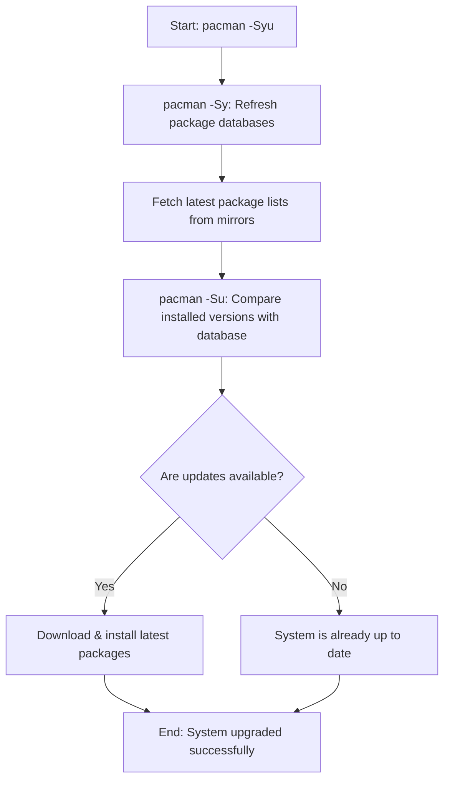

# Comprehensive Guide to `pacman -Syu` (System Upgrade)

In Arch Linux and Arch-based distributions (like EndeavourOS or Manjaro), the **`pacman -Syu`** command is the primary method used to synchronize package databases and perform a full system upgrade.

This guide explains what the command does, how its flags work, why it is crucial for system stability, and best practices to follow.

---

## 🔍 Command Breakdown

The command `pacman -Syu` combines three main operations:

| Flag | Long Option | Description |
| :--- | :--- | :--- |
| **`-S`** | `--sync` | Tells `pacman` to operate on the sync databases (installing, updating, or searching for packages). |
| **`-y`** | `--refresh` | Downloads fresh package databases from the configured mirrors. (Use `-yy` to force refresh). |
| **`-u`** | `--sysupgrade` | Upgrades all installed packages that have newer versions available in the refreshed databases. |

### Visual Representation of the Workflow



---

## ⚠️ The Golden Rule: Avoid Partial Upgrades!

Arch Linux is a **rolling release** distribution. This means packages are designed and compiled to work against the specific versions of other packages available at the time of the release.

### Why `pacman -Sy <package_name>` is Dangerous
If you run `pacman -Sy <package_name>` (syncing the database and installing/updating only one package), you create a **partial upgrade state**. 

For example:
1. You run `pacman -Sy`. Your local database now knows about a new version of `libfoo` (v2.0) and a new version of `bar` (v2.0, which depends on `libfoo` v2.0).
2. You run `pacman -S bar`. This installs `bar` v2.0.
3. However, your system still has `libfoo` v1.0 installed because you did not run a full upgrade (`-u`).
4. Result: `bar` fails to run, or worse, system-critical libraries break.

> [!IMPORTANT]
> **Always** run `pacman -Syu` before or during package installations to ensure your system dependencies remain completely consistent.

---

## 🚀 Step-by-Step System Upgrade Workflow

To upgrade your system safely, follow these steps:

### 1. Check Arch Linux News
Before performing a major upgrade, check the [Arch Linux home page](https://archlinux.org/) or use a terminal news reader. If an update requires manual intervention, it will be posted there with specific instructions.

### 2. Run the Upgrade Command
Open your terminal and run:
```bash
sudo pacman -Syu
```

### 3. Review the Package List and Transaction Size
`pacman` will list:
* Packages to be upgraded, reinstalled, or removed.
* Total download size and net upgrade size.

Review this list. If you see a major package (e.g., `linux` kernel, `mesa`, or your desktop environment like `KDE Plasma`) being updated, ensure you have time to let the update finish and potentially reboot.

### 4. Handle `.pacnew` and `.pacsave` Files
During upgrades, if a configuration file has been modified by both you and the package maintainer, `pacman` will not overwrite your file. Instead, it creates:
* `.pacnew`: A new default configuration file.
* `.pacsave`: A backup of your old configuration file (if a package is removed).

Use a merge tool like `meld` or utility tools like `pacdiff` to merge changes:
```bash
sudo pacdiff
```

---

## 📦 AUR & Wrappers (`yay` / `paru`)

Since you are running an Arch-based system with helper tools like `yay`, you can upgrade both official repository packages and Arch User Repository (AUR) packages in one go:

```bash
yay -Syu
```
*Note: `yay` defaults to `-Syu` if run without any arguments.*

---

## 🛠️ Troubleshooting Common Upgrade Errors

### 1. "Failed to commit transaction (conflicting files)"
This occurs when a package tries to install a file that already exists on your drive but is not owned by any package.
* **Solution**: Check which package owns the file using `pacman -Qo /path/to/file`. If it's safe to overwrite, you can delete/rename the conflicting file, or use `--overwrite`.

### 2. "Signature is marginal trust" or "Corrupted package"
This is usually caused by outdated keyring packages.
* **Solution**: Upgrade your keyrings first:
  ```bash
  sudo pacman -Sy archlinux-keyring && sudo pacman -Su
  ```

---

> [!TIP]
> Consider setting up automatic backups using a tool like **Timeshift** or **Btrfs snapshots** before running upgrades, so you can easily roll back if an update goes wrong.
